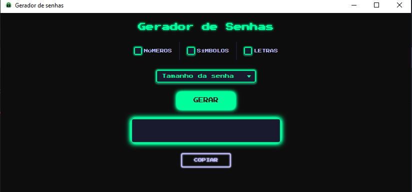

# 🔐 Gerador de Senhas

Aplicação desktop de gerador de senhas com tema cyberpunk/gamer, desenvolvida em **JavaFX**.


---

## 🖥️ Preview


> Interface com tema dark cyberpunk — fundo preto, neon verde e pixel art typography.

---

## ✨ Funcionalidades

- ✅ Geração de senhas com critérios customizáveis:
    - Números
    - Símbolos
    - Letras
- ✅ Seleção do tamanho da senha via ComboBox
- ✅ Cópia da senha para a área de transferência com um clique
- ✅ Interface estilizada com tema cyberpunk/gamer

---

## 🛠️ Tecnologias

| Tecnologia | Uso |
|------------|-----|
| Java 17 | Linguagem principal |
| JavaFX | Interface gráfica |
| FXML | Estrutura da UI |
| CSS (JavaFX) | Estilização customizada |
| Maven | Gerenciamento de dependências |
| Press Start 2P | Fonte pixel art (Google Fonts) |

---

## 🚀 Como executar

### Pré-requisitos

- JDK 17+
- Maven
- JavaFX SDK (caso não esteja configurado no Maven)

### Passos

```bash
# Clone o repositório
git clone https://github.com/seu-usuario/gerador-senhas.git

# Entre na pasta do projeto
cd gerador-senhas

# Execute com Maven
mvn javafx:run
```

---

## 📁 Estrutura do projeto

```
gerador-senhas/
├── src/
│   └── main/
│       ├── java/
│       │   └── geradordesenhas/geradorsenhas/
│       │       ├── MainApplication.java
│       │       └── MainController.java
│       └── resources/
│           └── geradordesenhas/geradorsenhas/
│               ├── main-view.fxml
│               ├── style.css
│               └── fonts/
│                   └── PressStart2P-Regular.ttf
├── pom.xml
└── README.md
```

---

## 👾 Desenvolvido por

**Dev Respawn** — [@respawn.dev](https://instagram.com/respawn.dev)

> *"Morreu no bug? Respawna e tenta de novo."*